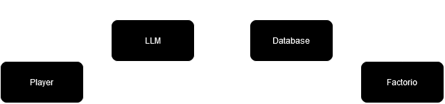
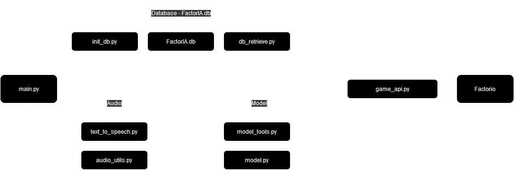

# FactorIA

**Enhancing the Factorio experience by leveraging the strengths of Large Language Models for real-time intelligent assistance.**

FactorIA is an innovative project that combines the automation and factory-building gameplay of Factorio with the advanced capabilities of a Large Language Model (LLM). This repository aims to enhance the Factorio experience by providing intelligent assistance, accurate crafting calculations, optimization suggestions, and interactive support through natural language processing.

[Experiments](pages/Experiments.md) | [TODO](pages/TODO.md)

## Intelligent Assistant Features
- **Retrieve and Accurately Report Player's Inventory:**
  - Automatically fetch and display the contents of the player's inventory.
- **Calculate Maximum Craft for Any Item with Player's Inventory:**
  - Determine the maximum number of any item that can be crafted using the current inventory.
- **Calculate Crafts for Items *Not* in Player's Inventory:**
  - Estimate crafting requirements for items that are not currently in the player's inventory.
- **Natural Language Support:**
  - Ask questions and get answers within the game using Text-to-speech and Speech-to-text to converse with the model with the wake word "Listen".

## Installation & Setup

### Installing FactorIAMod for Factorio
1. Download the "FactorIAMod" folder from this repository.
2. Place the folder into "{AppData}\Roaming\Factorio\mods".
3. The mod will show up under "Mods" as "FactorIA Mod" to be enabled.

### Enabling RCON (Remote Console) in Factorio
1. In Factorio's Main Men, hold the Ctrl + Alt and press "Settings".
2. The option "The rest" will appear.
3. Under "Other settings" are the configurations for:
- "local-rcon-socket"
- "local-rcon-password"
4. This enables the connection between the LLM and the game.

## Usage

## Tested On

Factorio version 1.1.109 (build 62320, win64), Vanilla

- OS:	Windows 11 Pro, 23H2, 64-bit
- OS build:	22631.3880
- Experience:	Windows Feature Experience Pack 1000.22700.1020.0

- CPU:	12th Gen Intel(R) Core(TM) i9-12900K   3.20 GHz
- GPU:	NVIDIA GeForce RTX 3090
- GPU Driver Version:	32.0.15.6070
- RAM: 64.0 GB DDR5

- Python: 3.11.5
